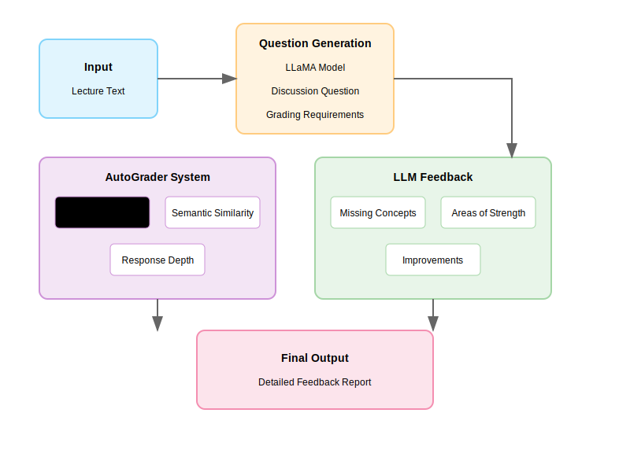
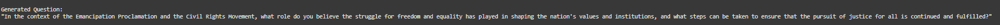
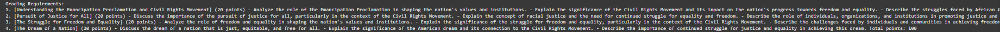
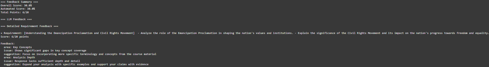

# Brightspace LLM

An AI-powered system that automatically generates discussion questions from educational content, creates grading requirements, and evaluates student responses with detailed feedback. This tool aims to assist educators in creating engaging discussion questions and providing consistent, detailed feedback to students.

## 🌟 Features

- **Intelligent Question Generation**: Automatically creates relevant discussion questions from educational content
- **Automated Grading Framework**: 
  - Creates specific grading requirements with point allocations
  - Weighted scoring system
  - Concept coverage analysis
- **Comprehensive Feedback System**:
  - Missing concepts identification
  - Areas of strength analysis
  - Actionable improvement suggestions
  - Numerical scoring with detailed breakdowns

## 🤖 Model Information

We utilize Meta's LLaMA-3.2-1B-Instruct model for generating questions and providing feedback. Here's a quick overview:

### Model Details
- **Name:** LLaMA-3.2-1B-Instruct
- **Type:** Instruction-tuned Language Model
- **Size:** 1 Billion Parameters
- **Provider:** Meta AI
- **HuggingFace ID:** meta-llama/Llama-3.2-1B-Instruct

### Primary Tasks
1. Discussion Question Generation
2. Grading Requirement Creation
3. Student Response Assessment

### Implementation
```python
from transformers import pipeline

model_id = "meta-llama/Llama-3.2-1B-Instruct"
pipe = pipeline(
    "text-generation",
    model=model_id,
    torch_dtype=torch.bfloat16,
    device_map="auto",
)
```

### Resource Requirements
- CUDA-compatible GPU (recommended)
- 8GB+ RAM
- ~2GB Storage for model weights

### Key Considerations
- Context window: 1024 tokens
- Processing time: 2-5 seconds per task
- No student data retention
- Local processing only
- Regular monitoring recommended


## 🏗️ Project Structure




```
├── main_app.py       # Main application logic and LLM pipeline
├── formatters.py     # Response cleaning and text formatting utilities
├── grader.py         # Automated grading system implementation
└── requirements.txt  # Project dependencies
```

## 📋 Requirements

### Core Dependencies
```txt
torch>=2.0.0
transformers>=4.30.0
huggingface_hub>=0.16.0
spacy>=3.5.0
tensorflow>=2.13.0
scikit-learn>=1.3.0
```

### System Requirements
- Python 3.8+
- CUDA-compatible GPU (recommended for faster processing)
- 8GB+ RAM
- Internet connection for model downloads

## 🚀 Setup

1. Clone the repository:
```bash
git clone https://github.com/coop9828/AI-Brightspace.git
```

2. Install dependencies:
```bash
pip install -r requirements.txt
python -m spacy download en_core_web_sm
```

3. Configure Hugging Face access:
```python
# Set your Hugging Face API token
export HUGGINGFACE_TOKEN='your_token_here'
```

## 💡 Usage

### Basic Usage
```bash
python main_app.py --input_file path/to/lecture.txt
```

### Advanced Configuration
```bash
python main_app.py --input_file path/to/lecture.txt --model meta-llama/Llama-3.2-1B-Instruct --threshold 0.6
```

<details>
  <summary>Generated Information</summary>
  
  
  
  
  
  
</details>


## 🔍 Components

### AutoGrader
- NLP-based response analysis
- Concept coverage calculation
- Semantic similarity matching
- Response depth evaluation

### AnswerAssessment
- Hybrid LLM-automated grading
- Composite scoring system
- Detailed feedback generation
- Performance analytics


## ⚠️ Limitations

- Feedback quality depends on input text clarity
- Limited to text-based educational content
- Requires parameter tuning for different subjects
- LLM responses need occasional verification
- Processing speed depends on hardware capabilities

## 💭 Critical Analysis

1. **Scalability of Personalized Education**
   - Enables instructors to provide detailed, consistent feedback to large numbers of students
   - Reduces the time burden on educators while maintaining feedback quality
   - Makes discussion-based learning more feasible in large-scale educational settings

2. **Standardization and Fairness**
   - Provides consistent grading criteria across all student responses
   - Reduces potential human bias in evaluation
   - Creates transparent, reproducible assessment standards

3. **Educational Resource Optimization**
   - Automates routine aspects of discussion management
   - Allows educators to focus on higher-value interactions with students
   - Facilitates rapid iteration and improvement of educational content

### Key Revelations

The development and testing of this system revealed several insights:

1. **AI Capabilities in Education**
   - LLMs can effectively generate contextually relevant discussion questions
   - Automated systems can provide nuanced feedback on complex responses
   - Hybrid approaches (automated + LLM) produce more reliable results

2. **Technical Insights**
   - Natural language processing can effectively evaluate student comprehension
   - Semantic similarity measures require careful tuning for educational content
   - Response depth analysis benefits from multiple evaluation metrics

3. **Implementation Challenges**
   - Balancing automation with human oversight
   - Maintaining consistency across different subject matters
   - Managing computational resources effectively

## 🔮 Future Improvements

- LMS integration (Canvas, Blackboard, Moodle)
- Enhanced instructor feedback loop
- Multiple question type support
- Domain-specific training capabilities
- Real-time grading optimization

## 📚 Related Resources

### AI in Education
- [Carnegie Learning's AI Research](https://www.carnegielearning.com/research/)
- [EdX's AI in Education Course](https://www.edx.org/learn/artificial-intelligence)
- [Stanford's AI in Education Research](https://ai.stanford.edu/research/ai-education)

### Technical Resources
- [Hugging Face Transformers Documentation](https://huggingface.co/docs/transformers/index)
- [spaCy Course](https://course.spacy.io/)
- [Scikit-learn Documentation](https://scikit-learn.org/stable/documentation.html)

### Research Papers
1. ["AI in Education: Current Trends and Future Perspectives"](https://www.frontiersin.org/articles/10.3389/frai.2022.871043/)
2. ["Automated Essay Scoring and the Future of Educational Assessment"](https://eric.ed.gov/?id=EJ1067807)
3. ["Natural Language Processing in Education"](https://www.sciencedirect.com/science/article/pii/S2666920X21000157)

## 📄 License

This project is licensed under the MIT License - see the [LICENSE.md](LICENSE.md) file for details.

## 🙏 Acknowledgments

- Meta AI for the LLaMA model
- Hugging Face for transformer implementations
- spaCy for NLP tools
- The educational technology community

[Insert Project Team/Contributors Photos Here]

